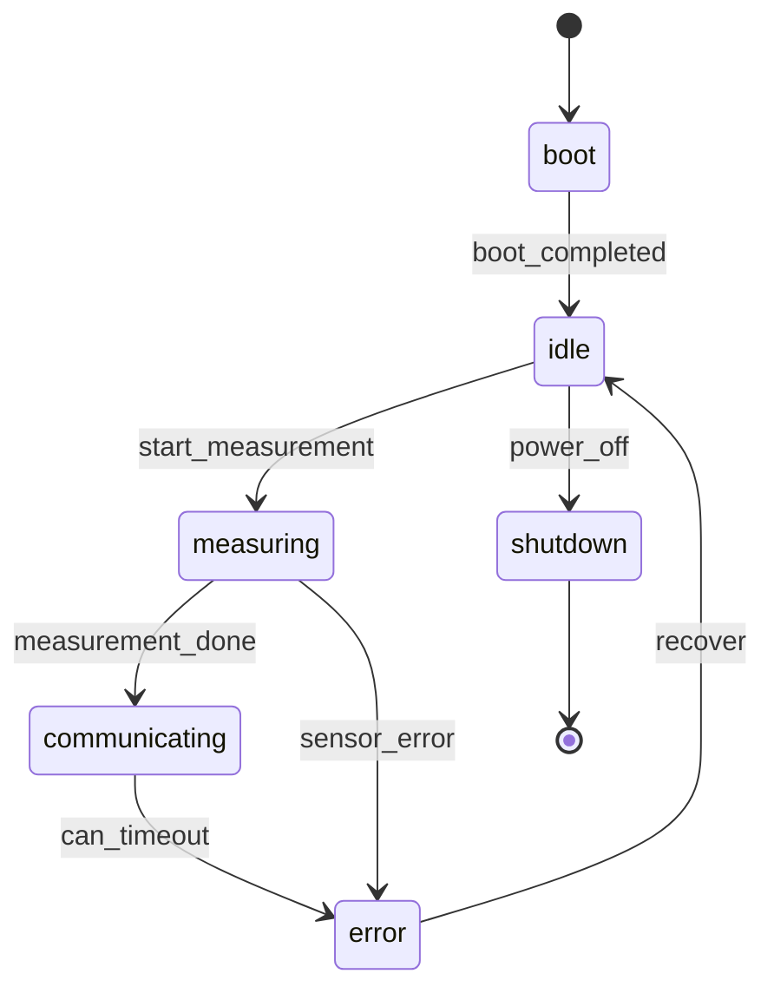
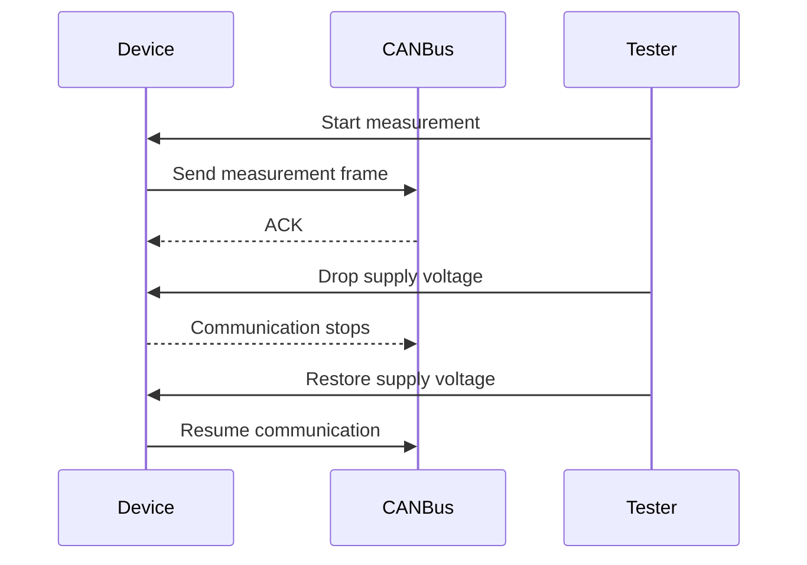
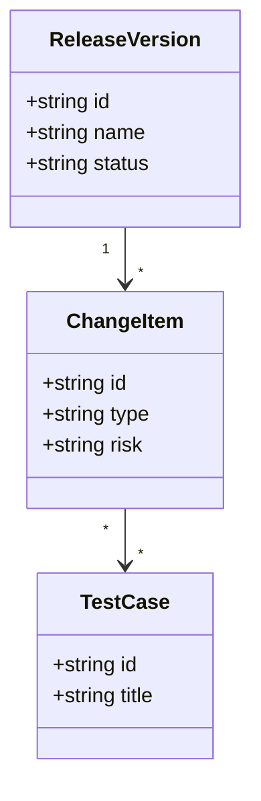

# SpecMatrix 仕様案

## 1. コンセプト

SpecMatrix は、組み込み開発向けの **仕様駆動テスト妥当性管理システム** である。

特に、ウォーターフォール開発における定期リリースを想定し、リリースバージョン、エンハンス、不具合対策、テスト状況、不具合状況を一元的に監視する。

従来のテスト管理ツールが主に「作成済みテストケースの管理」を中心にしていたのに対し、SpecMatrix は次の問いに答えることを目的とする。

> このテスト設計で、仕様・構成・状態・異常系・過去不具合を十分に検証できているか。

そのため、単なるテストケース管理ではなく、以下を統合して扱う。

- 要求解析
- ハードウェア構成管理
- Mermaid による状態遷移・I/O・通信仕様のモデル化
- テストケースとのトレーサビリティ
- ルールベース検査
- AI によるテスト観点レビュー
- 実施結果とエビデンス管理
- リリース単位の品質監視
- エンハンス・不具合対策単位のテスト進捗管理

## 2. 目的

SpecMatrix の目的は、組み込み開発で起きやすいテスト漏れを早期に検出し、テスト設計の妥当性を説明可能な形で管理することである。

特に次のような不足を検出する。

- リリース対象のエンハンスや不具合対策にテストケースが紐付いていない
- リリースバージョン全体のテスト完了条件を満たしていない
- リリース内に未解決の重大不具合が残っている
- 仕様要求に対応するテストケースが存在しない
- 異常系、境界値、タイミング条件の観点が不足している
- ハードウェア差分や部品差分を考慮したテスト条件が不足している
- 状態遷移の一部状態・イベントが未検証である
- 通信断、電源断、センサー異常などの組み込み固有リスクが未試験である
- 過去不具合に対する再発防止テストが存在しない
- テストケースは存在するが、期待結果や条件が曖昧である

## 3. 想定ユーザー

- 組み込みソフトウェアエンジニア
- QA エンジニア
- テスト設計者
- システム設計者
- 機能安全・品質保証担当者
- プロジェクトリーダー

## 4. 基本ワークフロー

```text
仕様書
リリース計画
エンハンス一覧
不具合対策一覧
ハードウェア構成
状態遷移
I/O一覧
通信仕様
安全要求
過去不具合
    ↓
要求抽出・構造化
リリース対象変更の構造化
    ↓
AI / ルール / モデル解析
    ↓
テスト観点の抽出
網羅性チェック
矛盾検出
未試験リスク検出
リリース品質リスク検出
    ↓
テストケース生成・レビュー
    ↓
リリース別テスト実施管理・エビデンス管理
```

## 5. 最小構成

初期バージョンでは、Web アプリケーションとして以下の機能を MVP とする。

1. 仕様書を Markdown / Asciidoc / Word / PDF から取り込む
2. リリースバージョンを登録・管理する
3. リリースに含まれるエンハンスと不具合対策を登録・管理する
4. 要求を ID 付きで抽出・管理する
5. ハードウェア構成を登録・管理する
6. テストケースを ID 付きで登録・管理する
7. 要求、エンハンス、不具合対策、テストケースの対応表を作成する
8. リリースバージョン単位でテスト計画、実施結果、エビデンスを管理する
9. AI とルールベース検査により、未対応要求や弱い異常系を指摘する
10. 指摘理由、根拠、推奨テストケースを説明可能な形で表示する
11. AI 指摘に対する承認、却下、保留を管理する
12. ダッシュボードでリリース品質状態を監視する

アーキテクチャ方針は [architecture.md](architecture.md) に記載する。

## 6. 入力データ

### 6.1 リリースバージョン

リリースバージョンは、ウォーターフォール開発における品質監視の最上位単位として扱う。

リリースバージョンには、複数のエンハンス、不具合対策、テスト計画、テスト実施結果、不具合状況が紐付く。

```yaml
release_versions:
  - id: REL-1.4.0
    name: Firmware v1.4.0
    status: testing
    planned_release_date: 2026-07-31
    target_boards:
      - main_board_revA
      - main_board_revB
    quality_gates:
      required_test_pass_rate: 100
      max_open_critical_defects: 0
      max_open_high_defects: 0
      require_all_high_risk_requirements_tested: true
```

### 6.2 変更項目

変更項目は、リリースに含まれるエンハンスまたは不具合対策を表す。

```yaml
change_items:
  - id: ENH-2026-001
    release_version: REL-1.4.0
    type: enhancement
    title: Add current sensor monitoring
    status: test_design
    related_requirements:
      - REQ-SENSOR-010
    risk: high

  - id: FIX-2026-014
    release_version: REL-1.4.0
    type: defect_fix
    title: Fix CAN recovery failure after low voltage event
    status: testing
    related_defects:
      - BUG-2024-017
    related_requirements:
      - REQ-POWER-001
    risk: high
```

変更項目の種別は以下を基本とする。

- enhancement
- defect_fix
- refactoring
- hardware_change
- safety_change
- documentation_change

### 6.3 仕様書

仕様書は以下の形式をサポートする。

- Markdown
- Asciidoc
- Word
- PDF
- プレーンテキスト

仕様書からは、要求、制約、条件、例外、状態、I/O、通信、タイミング、安全要求を抽出する。

抽出された要求には、システム内で安定した ID を付与する。

```yaml
requirements:
  - id: REQ-POWER-001
    title: Low voltage recovery
    source: spec.md#3.2.1
    text: The device shall recover communication after low voltage is cleared.
    category: power
    risk: high
```

### 6.4 ハードウェア構成

ハードウェア構成は Web UI で登録し、YAML インポートにも対応する。

```yaml
boards:
  - name: main_board_revA
    mcu: STM32F407
    sensors:
      - temperature
      - pressure
    interfaces:
      - UART
      - CAN
      - GPIO

  - name: main_board_revB
    mcu: STM32F407
    sensors:
      - temperature
      - pressure
      - current
    interfaces:
      - UART
      - CAN
      - GPIO
      - SPI

power:
  modes:
    - normal
    - low_voltage
    - sudden_shutdown

environment:
  temperature:
    min: -20
    max: 85
    unit: celsius
```

### 6.5 モデル図

状態遷移、通信シーケンス、構造図などの UML 相当のモデル図は、独自形式ではなく Mermaid 記法で定義する。

SpecMatrix は Mermaid のテキストを保存し、表示、差分確認、解析に利用する。

ユーザーが作成・確認する記法は Mermaid 公式の記法に従う。作図確認には Mermaid Web / Live Editor を利用できる。

- Mermaid Web: https://mermaid.ai/web/
- Mermaid syntax reference: https://mermaid.js.org/intro/syntax-reference.html

初期対応する Mermaid 図は以下とする。

- stateDiagram-v2: 状態遷移
- sequenceDiagram: 通信仕様、制御シーケンス
- classDiagram: ソフトウェア構造、データ構造
- flowchart: 処理フロー、判定フロー

状態遷移の例:



通信シーケンスの例:



構造図の例:



モデル図は、要求、変更項目、テストケース、AI 指摘と紐付けられる。

解析時には、Mermaid 記法から状態、イベント、参加者、関係を抽出し、以下の検査に利用する。

- 状態遷移の未通過状態
- 未試験イベント
- 異常遷移のテスト不足
- 通信シーケンス上のタイムアウト、再送、復帰条件の不足
- モデル図に存在する要素とテストケース条件の対応漏れ

### 6.6 テストケース

テストケースは ID、目的、前提条件、手順、期待結果、対象要求、対象構成、対象変更項目を持つ。

```yaml
test_cases:
  - id: TC-POWER-LOW-RECOVERY
    title: Low voltage recovery during CAN communication
    change_items:
      - FIX-2026-014
    requirements:
      - REQ-POWER-001
    boards:
      - main_board_revA
      - main_board_revB
    conditions:
      power: low_voltage
      interface: CAN
    steps:
      - Start CAN communication.
      - Drop supply voltage below threshold.
      - Restore supply voltage.
    expected:
      - Device resumes CAN communication within the specified recovery time.
```

### 6.7 テストキャンペーン

テストキャンペーンは、リリースバージョンに対するテスト実施単位を表す。

例として、単体テスト、結合テスト、システムテスト、リグレッションテスト、リリース判定テストを分けて管理する。

```yaml
test_campaigns:
  - id: TCAMP-REL-1.4.0-SYSTEM
    release_version: REL-1.4.0
    name: Firmware v1.4.0 System Test
    phase: system_test
    status: in_progress
    scope:
      change_items:
        - ENH-2026-001
        - FIX-2026-014
      boards:
        - main_board_revA
        - main_board_revB
```

### 6.8 不具合

不具合は、過去不具合だけでなく、リリース試験中に検出された未解決不具合も管理対象とする。

```yaml
defects:
  - id: BUG-2026-032
    release_version: REL-1.4.0
    title: Current sensor value is unstable after warm boot
    severity: high
    status: open
    detected_in_campaign: TCAMP-REL-1.4.0-SYSTEM
    affected_boards:
      - main_board_revB
    related_change_items:
      - ENH-2026-001
    related_requirements:
      - REQ-SENSOR-010
```

### 6.9 過去不具合

過去不具合は、再発防止テストの有無を確認するための入力として扱う。

```yaml
defects:
  - id: BUG-2024-017
    title: CAN communication did not recover after low voltage event
    affected_boards:
      - main_board_revA
    related_requirements:
      - REQ-POWER-001
    required_regression_test: true
```

## 7. 主要機能

### 7.1 リリース品質管理

リリースバージョン単位で、品質状態を監視する。

リリース品質管理では以下を確認する。

- リリースに含まれるエンハンス一覧
- リリースに含まれる不具合対策一覧
- 変更項目ごとの要求、テストケース、実施結果
- リリース全体のテスト計画と進捗
- リリース全体の合格、失敗、未実施、ブロック状態
- リリース中に検出された不具合の件数、重要度、未解決状況
- リリース判定条件に対する達成状況

リリース品質の代表指標は以下とする。

| 指標 | 内容 |
| --- | --- |
| Change item coverage | 変更項目にテストケースが紐付いている割合 |
| Requirement coverage | 要求にテストケースが紐付いている割合 |
| Test execution progress | リリース対象テストの実施進捗 |
| Test pass rate | 実施済みテストに対する合格率 |
| Open defect count | 未解決不具合数 |
| Critical defect count | 未解決の重大不具合数 |
| Regression coverage | 不具合対策に再発防止テストがある割合 |
| Release gate status | リリース判定条件の合否 |

### 7.2 変更項目管理

エンハンス、不具合対策、ハードウェア変更などを変更項目として管理する。

変更項目には、対象リリース、関連要求、関連不具合、リスク、テスト状況を紐付ける。

変更項目ごとに以下を確認できるようにする。

- テストケースが存在するか
- テスト設計が完了しているか
- テスト実施が完了しているか
- 失敗テストが残っていないか
- 未解決不具合が残っていないか
- AI またはルールによる未対応指摘が残っていないか

### 7.3 要求抽出

仕様書から要求候補を抽出し、ユーザーが確認・修正できるようにする。

抽出対象は以下とする。

- 機能要求
- 非機能要求
- 安全要求
- 異常系要求
- タイミング要求
- 境界値
- 通信仕様
- 電源条件
- センサー条件
- ハードウェア依存条件

AI は要求候補を抽出するが、最終的な確定はユーザー操作で行う。

### 7.4 トレーサビリティ管理

リリース、変更項目、要求、テストケース、ハードウェア構成、不具合、過去不具合を関連付ける。

代表的な対応関係は以下とする。

```text
リリース ↔ 変更項目
リリース ↔ テストキャンペーン
変更項目 ↔ 要求
変更項目 ↔ テストケース
変更項目 ↔ 不具合
要求 ↔ テストケース
要求 ↔ ハードウェア構成
要求 ↔ モデル図
要求 ↔ 過去不具合
テストケース ↔ 実施結果
テストケース ↔ エビデンス
```

### 7.5 網羅性チェック

次の観点で網羅性を確認する。

- すべてのリリース対象変更項目にテストケースが紐付いているか
- すべての不具合対策に再発防止テストが存在するか
- すべての要求にテストケースが紐付いているか
- すべての高リスク要求に異常系テストが存在するか
- すべての電源モードで必要な機能が確認されているか
- すべての通信インターフェースで正常系・異常系が確認されているか
- すべての状態とイベントの組み合わせが確認されているか
- すべての対象ボードで必要なテストが実施されているか
- 過去不具合に対する再発防止テストが存在するか

### 7.6 組み込み向けレビュー観点

初期ルールセットでは、以下の観点を標準で提供する。

| 観点 | チェック内容 |
| --- | --- |
| 機能要求 | 要求ごとにテストケースが存在するか |
| 変更項目 | エンハンス、不具合対策ごとにテストケースが存在するか |
| リリース | リリース判定条件を満たしているか |
| 不具合状況 | 未解決の重大不具合が残っていないか |
| 異常系 | 電源断、通信断、センサー異常、タイムアウトを確認しているか |
| HW 構成 | ボード差分、部品差分、インターフェース差分を考慮しているか |
| Mermaid モデル図 | 全状態、全イベント、異常遷移、通信シーケンスを通っているか |
| 境界値 | 電圧、温度、タイミング、バッファ長、閾値を確認しているか |
| 過去不具合 | 再発防止テストが存在するか |
| 通信 | 切断、遅延、再送、CRC 異常、バスオフを確認しているか |
| 電源 | 低電圧、瞬断、復帰、起動中断を確認しているか |
| センサー | 未接続、固定値、異常値、ノイズを確認しているか |

### 7.7 AI レビュー

AI レビューは、仕様、構成、テストケースを入力として、テスト設計の不足を指摘する。

ただし、AI の出力は単独の判断結果として扱わず、必ず根拠を持つレビュー項目として保存する。

出力形式は以下を基本とする。

```yaml
findings:
  - id: FINDING-POWER-001
    severity: high
    title: Low voltage communication recovery test is missing
    finding: 低電圧時の通信復帰試験が不足しています。
    evidence:
      - 仕様書 3.2.1 に低電圧復帰要件があります。
      - HW 構成に power.low_voltage があります。
      - 既存テストケースに low_voltage と CAN recovery を同時に扱う条件がありません。
    recommendation:
      action: add_test_case
      suggested_id: TC-POWER-LOW-RECOVERY
      description: 低電圧解除後に CAN 通信が規定時間内に復帰することを確認する。
    linked_requirements:
      - REQ-POWER-001
```

### 7.8 ルールベース検査

説明可能性と再現性を確保するため、AI だけでなくルールベース検査を併用する。

例:

```yaml
rules:
  - id: RULE-REQ-HAS-TEST
    description: Every requirement must have at least one linked test case.
    severity: high

  - id: RULE-POWER-MODE-COVERAGE
    description: Every declared power mode must be covered by at least one test case when power behavior requirements exist.
    severity: medium

  - id: RULE-DEFECT-REGRESSION
    description: Every past defect marked as requiring regression must have a linked regression test.
    severity: high

  - id: RULE-CHANGE-HAS-TEST
    description: Every release change item must have at least one linked test case.
    severity: high

  - id: RULE-RELEASE-NO-OPEN-CRITICAL
    description: A release candidate must not have open critical defects.
    severity: critical
```

### 7.9 テストケース生成支援

不足が検出された場合、AI はテストケース案を生成する。

生成されるテストケース案には、以下を含める。

- テスト ID 案
- タイトル
- 対象要求
- 対象変更項目
- 対象ボード
- 前提条件
- 入力条件
- 手順
- 期待結果
- 必要な計測・ログ
- 推奨エビデンス

AI が生成したテストケースは、ユーザーが承認するまで正式なテストケースとして扱わない。

### 7.10 実施管理

テストケースの実施状態を、リリースバージョンとテストキャンペーンに紐付けて管理する。

```yaml
executions:
  - test_case_id: TC-POWER-LOW-RECOVERY
    release_version: REL-1.4.0
    test_campaign: TCAMP-REL-1.4.0-SYSTEM
    result: pass
    tester: user@example.com
    executed_at: 2026-05-26T10:00:00+09:00
    environment:
      board: main_board_revB
      firmware: v1.4.2
      toolchain: gcc-arm-none-eabi-12
    evidence:
      - logs/can_recovery_20260526.log
      - images/power_waveform_20260526.png
```

### 7.11 不具合状況管理

リリースバージョン内で検出された不具合を管理する。

品質監視では、単なる不具合一覧ではなく、リリース判定に影響する状態を確認する。

- 未解決不具合数
- 重要度別の未解決不具合数
- 修正済みだが再テスト未完了の不具合数
- 再発防止テストが未登録の不具合対策数
- 特定のエンハンスに集中している不具合数
- 特定のボードや環境に偏っている不具合数

不具合の基本状態は以下とする。

- open
- analyzing
- fixed
- retest_ready
- retesting
- verified
- closed
- deferred

### 7.12 リリース判定

リリースバージョンごとに、品質ゲートを定義し、リリース可否を判定する。

初期の品質ゲートは以下を想定する。

- リリース対象変更項目のテストケース紐付けが完了している
- 高リスク要求のテストがすべて実施済みである
- 必須テストキャンペーンがすべて完了している
- 未解決の critical / high 不具合が存在しない
- 不具合対策に再発防止テストが紐付いている
- AI 指摘の high 以上が承認済みまたは対応済みである
- 必須エビデンスが添付されている

判定結果は以下とする。

- pass
- warning
- fail
- blocked

### 7.13 エビデンス管理

テスト実施結果に紐付くログ、波形、スクリーンショット、シリアル出力、CI 結果を管理する。

初期バージョンでは、ファイルパスまたは URL の参照管理を行う。

## 8. 画面案

### 8.1 ダッシュボード

ダッシュボードは、リリースバージョンを選択して品質状態を確認できるようにする。

- リリースバージョン
- リリースステータス
- 変更項目数
- エンハンス数
- 不具合対策数
- 要求数
- テストケース数
- 未対応要求数
- 未対応変更項目数
- 高リスク未対応数
- AI 指摘数
- ルール違反数
- 実施済みテスト数
- 未実施テスト数
- 失敗テスト数
- ブロック中テスト数
- 未解決不具合数
- 未解決 critical / high 不具合数
- リリース判定結果

### 8.2 リリース一覧・詳細

- リリース ID
- バージョン名
- 状態
- リリース予定日
- 対象ボード
- 変更項目数
- テスト進捗
- 不具合状況
- 品質ゲート状態
- リリース判定

リリース詳細では、以下を表示する。

- エンハンス別テスト状況
- 不具合対策別テスト状況
- テストキャンペーン別進捗
- 未解決不具合
- 未対応 AI 指摘
- リリース判定条件の達成状況

### 8.3 変更項目一覧・詳細

- 変更項目 ID
- 種別
- タイトル
- 対象リリース
- リスク
- 状態
- 関連要求
- 関連不具合
- 紐付くテストケース
- テスト実施状態
- 未解決不具合数

変更項目詳細では、そのエンハンスまたは不具合対策がリリース可能な状態かを確認できるようにする。

### 8.4 要求一覧

- 要求 ID
- タイトル
- 種別
- リスク
- 参照元
- 紐付くテストケース
- カバレッジ状態

### 8.5 テストケース一覧

- テスト ID
- タイトル
- 対象リリース
- 対象変更項目
- 対象要求
- 対象ボード
- 条件
- 実施状態
- 最終実施結果

### 8.6 カバレッジマトリクス

要求、変更項目、テストケースの対応表を表示する。

```text
                 TC-001  TC-002  TC-003
ENH-2026-001       x              x
FIX-2026-014              x       x
REQ-POWER-001      x              x
REQ-CAN-002               x       x
REQ-SENSOR-003
```

空欄の要求または変更項目は未対応候補として強調する。

### 8.7 不具合状況画面

- 不具合 ID
- 対象リリース
- 重要度
- 状態
- 検出テストキャンペーン
- 関連変更項目
- 関連要求
- 修正状況
- 再テスト状況
- クローズ可否

### 8.8 AI レビュー画面

- 指摘
- 重要度
- 根拠
- 対象リリース
- 関連変更項目
- 関連要求
- 関連テストケース
- 推奨対応
- 承認、保留、却下

### 8.9 リリース判定画面

- 品質ゲート一覧
- ゲートごとの判定結果
- リリース阻害要因
- 未完了テスト
- 未解決不具合
- 未対応 AI 指摘
- 必須エビデンス不足
- リリース判定コメント

## 9. データモデル概要

```text
Project
  ├─ ReleaseVersion
  ├─ ChangeItem
  ├─ SpecificationDocument
  ├─ Requirement
  ├─ HardwareConfiguration
  ├─ ModelDiagram
  ├─ TestCase
  ├─ TestCampaign
  ├─ TestExecution
  ├─ Evidence
  ├─ Defect
  ├─ Rule
  ├─ Finding
  └─ ReleaseGate
```

主要エンティティの関係は以下とする。

```text
Project 1 ↔ 0..* ReleaseVersion
ReleaseVersion 1 ↔ 0..* ChangeItem
ReleaseVersion 1 ↔ 0..* TestCampaign
ReleaseVersion 1 ↔ 0..* Defect
ReleaseVersion 1 ↔ 0..* ReleaseGate
ChangeItem 0..* ↔ 0..* Requirement
ChangeItem 0..* ↔ 0..* TestCase
ChangeItem 0..* ↔ 0..* Defect
Requirement 1..* ↔ 0..* TestCase
Requirement 0..* ↔ 0..* HardwareConfiguration
Requirement 0..* ↔ 0..* Defect
Requirement 0..* ↔ 0..* ModelDiagram
TestCampaign 1 ↔ 0..* TestExecution
TestCase 1 ↔ 0..* TestExecution
TestExecution 1 ↔ 0..* Evidence
Finding 1 ↔ 0..* Requirement
Finding 1 ↔ 0..* TestCase
Finding 0..* ↔ 0..* ChangeItem
Finding 0..* ↔ 0..* ReleaseVersion
```

ウォーターフォール開発では、以下の階層を基本とする。

```text
Project
  └─ ReleaseVersion
      ├─ ChangeItem
      │   ├─ Requirement
      │   ├─ TestCase
      │   └─ Defect
      ├─ TestCampaign
      │   └─ TestExecution
      ├─ Finding
      └─ ReleaseGate
```

## 10. 非機能要件

### 10.1 説明可能性

すべての指摘には、根拠、参照元、対象データ、推奨対応を含める。

### 10.2 再現性

ルールベース検査は、同じ入力に対して同じ結果を返す。

AI レビュー結果についても、使用モデル、プロンプトバージョン、入力データのハッシュを保存する。

### 10.3 監査性

リリース、変更項目、要求、テストケース、テスト実施、不具合、AI 指摘、承認操作、却下操作の変更履歴を保持する。

### 10.4 拡張性

プロジェクトごとにルールセットを追加できる。

### 10.5 セキュリティ

仕様書や不具合情報には機密情報が含まれるため、以下を考慮する。

- ローカル実行モード
- オンプレミス LLM 対応
- 外部 AI API 利用時の送信範囲制御
- プロジェクト単位のアクセス制御
- エビデンスファイルの権限管理

## 11. CLI 案

CLI は主軸ではなく、CI や外部連携用の補助インターフェースとして提供する。

```bash
specmatrix init
specmatrix import-spec docs/spec.md
specmatrix validate
specmatrix review --ai
specmatrix coverage
specmatrix suggest-tests
specmatrix import-results --release REL-1.4.0 junit.xml
specmatrix release-gate REL-1.4.0
```

出力例:

```text
Coverage Summary
----------------
Requirements: 128
Change items: 24
Test cases: 214
Uncovered requirements: 9
Uncovered change items: 2
High risk uncovered requirements: 3
Hardware condition gaps: 4
Past defect regression gaps: 2
Open critical defects: 0
Open high defects: 1
Release gate: fail
```

## 12. CI 連携

CI 上で `specmatrix validate` を実行し、以下の条件を検出できるようにする。

- リリース対象変更項目にテストケースがない
- 高リスク要求にテストケースがない
- 必須ルールに違反している
- 過去不具合の再発防止テストが削除された
- 仕様変更により要求が追加されたが、テストが追加されていない
- リリース候補に未解決の critical / high 不具合が残っている
- リリース判定条件を満たしていない

CI では、エラー、警告、情報の 3 段階で結果を返す。

## 13. 既存ツールとの差別化

Kiwi TCMS や TestLink は、テストケースや実施結果の管理に強い。

一方、SpecMatrix は以下を中心価値とする。

> テスト実施管理ではなく、テスト妥当性管理を中心にする。

差別化ポイントは以下である。

- 仕様とテストのトレーサビリティを中心に設計する
- リリース、エンハンス、不具合対策ごとの品質状態を監視できる
- 組み込み固有の HW 条件、状態遷移、電源、通信、センサー異常を扱う
- AI とルールベース検査を組み合わせる
- 指摘には必ず根拠を付与する
- 過去不具合を再発防止テストに接続する
- CI でテスト設計とリリース品質の劣化を検出する

## 14. 段階的ロードマップ

### Phase 1: Web Monolith MVP

- ユーザー認証
- プロジェクト管理
- リリースバージョン管理
- エンハンス、不具合対策の変更項目管理
- 要求、HW 構成、テストケース管理
- 要求、変更項目、テストケースの対応チェック
- リリースダッシュボード
- 基本ルール検査
- PostgreSQL による永続化

### Phase 2: テスト実施・不具合管理

- テストキャンペーン管理
- テスト実施結果の記録
- エビデンス管理
- 不具合状況管理
- リリース判定画面
- レポート生成

### Phase 3: AI レビュー

- AI による要求抽出
- AI による未試験リスク指摘
- リリース対象変更に対するテスト不足指摘
- テストケース案生成
- 指摘の承認、却下、保留

### Phase 4: CI・外部連携

- CI からの検査
- JUnit XML 取り込み
- Git 連携
- リリースゲート API
- Markdown / PDF レポート出力

### Phase 5: 高度な品質分析

- 状態遷移網羅性
- Mermaid モデル図からの状態・イベント抽出
- 組み合わせテスト観点生成
- 境界値自動抽出
- ハードウェア差分解析
- 過去不具合クラスタリング
- リリース間の品質トレンド分析
- エンハンス別の不具合密度分析
- 不具合対策の再発傾向分析

## 15. 成功基準

MVP の成功基準は以下とする。

- 仕様書から抽出した要求を ID 付きで管理できる
- リリースバージョンを登録し、対象変更項目を紐付けできる
- エンハンス、不具合対策ごとにテスト状況を確認できる
- テストケースと要求、変更項目を対応付けできる
- 未対応要求を検出できる
- 未対応変更項目を検出できる
- HW 条件不足を検出できる
- 過去不具合に対する再発防止テスト不足を検出できる
- リリース単位でテスト実施状況を確認できる
- リリース単位で未解決不具合状況を確認できる
- リリース判定条件の達成状況を確認できる
- 指摘に根拠と推奨対応を表示できる
- Web ダッシュボードで品質状態を確認できる

## 16. 設計方針

SpecMatrix は、AI を「判断の代替」ではなく「レビュー支援」として扱う。

品質保証で重要なのは、指摘の正しさだけではなく、なぜその指摘が出たのかを人間が確認できることである。

したがって、本システムは以下の原則を持つ。

- AI の出力は必ず根拠付きにする
- ルールベース検査で再現性を確保する
- リリース、変更項目、仕様、構成、テスト、実施結果、不具合をトレーサブルに接続する
- ユーザーが AI 指摘を承認、却下、修正できるようにする
- 組み込み開発のリリース判定で説明できるレポートを生成する

## 17. まとめ

SpecMatrix は、テストケースを保管するためのシステムではなく、テスト設計が仕様、変更項目、リリースリスクに対して妥当かを検証するためのシステムである。

組み込み開発における仕様、リリースバージョン、エンハンス、不具合対策、ハードウェア構成、状態遷移、異常系、過去不具合を統合し、AI とルールベース検査によってテスト漏れやリリース阻害要因を説明可能な形で提示する。

この方向性により、従来のテスト管理ツールでは扱いにくかった「試験設計の妥当性」と「リリース品質の現在地」を管理対象にできる。
